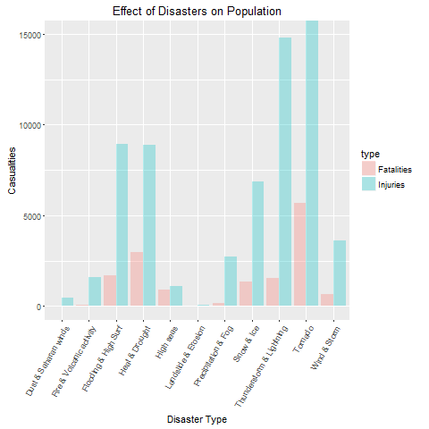
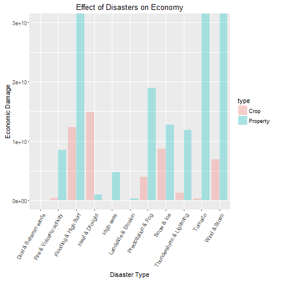

# Effect of Severe Weather Events on Ecomomy
## Synopsis

Storms and other severe weather events can cause both public health and economic problems for communities and municipalities. Many severe events can result in fatalities, injuries, and property damage, and preventing such outcomes to the extent possible is a key concern. The basic aim of this analysis is to explore which type of events are most harmful for the human population in terms of casualities as well as to the economy in terms of damage and destruction they bring along. The document is divided into sections to make the analysis more readable and easy to understand. Sections include information on how data has been transformed and then aggregated to finally reach the quantitative figures depicting the catastrophy these disasters bring to the humans as well as to the property.

## Data Processing

Downloading the dataset and unzipping to obtain the original .csv file.


```r
library(R.utils)
setwd("~/Reproducible-Research-Assignment-2-Coursera/")
if(!file.exists("stormdata.csv.bz2")){
  download.file("https://d396qusza40orc.cloudfront.net/repdata%2Fdata%2FStormData.csv.bz2", destfile = "~/Reproducible-Research-Assignment-2-Coursera/stormdata.csv.bz2")
  }
bunzip2("stormdata.csv.bz2", "storm.csv", remove = FALSE)
data <- read.csv("storm.csv")
```

Subsetting the original data to have only the columns to be used in the analysis


```r
reduced <- data[,c('EVTYPE','FATALITIES','INJURIES','PROPDMG', 'PROPDMGEXP', 'CROPDMG', 'CROPDMGEXP')]
rm(data)
```

### Renaming Storm Events

Most of the event types listed in the data area repeated with different names. To avoid such uncertainty this sub section classifies the event types into 11 types.


```r
reduced$evname <- NA
reduced[grepl("precipitation|rain|hail|drizzle|wet|percip|burst|depression|fog|wall cloud", reduced$EVTYPE, ignore.case = TRUE), "evname"] <- "Precipitation & Fog"
reduced[grepl("wind|storm|wnd|hurricane|typhoon", reduced$EVTYPE, ignore.case = TRUE), "evname"] <- "Wind & Storm"
reduced[grepl("slide|erosion|slump", reduced$EVTYPE, ignore.case = TRUE), "evname"] <- "Landslide & Erosion"
reduced[grepl("warmth|warm|heat|dry|hot|drought|thermia|temperature record|record temperature|record high", reduced$EVTYPE, ignore.case = TRUE), "evname"] <- "Heat & Drought"
reduced[grepl("cold|cool|ice|icy|frost|freeze|snow|winter|wintry|wintery|blizzard|chill|freezing|avalanche|glaze|sleet", reduced$EVTYPE, ignore.case = TRUE), "evname"] <- "Snow & Ice"
reduced[grepl("flood|surf|blow-out|swells|fld|dam break", reduced$EVTYPE, ignore.case = TRUE), "evname"] <- "Flooding & High Surf"
reduced[grepl("seas|high water|tide|tsunami|wave|current|marine|drowning", reduced$EVTYPE, ignore.case = TRUE), "evname"] <- "High seas"
reduced[grepl("dust|saharan", reduced$EVTYPE, ignore.case = TRUE), "evname"] <- "Dust & Saharan winds"  
reduced[grepl("tstm|thunderstorm|lightning", reduced$EVTYPE, ignore.case = TRUE), "evname"] <- "Thunderstorm & Lightning"
reduced[grepl("tornado|spout|funnel|whirlwind", reduced$EVTYPE, ignore.case = TRUE), "evname"] <- "Tornado"
reduced[grepl("fire|smoke|volcanic", reduced$EVTYPE, ignore.case = TRUE), "evname"] <- "Fire & Volcanic activity"
reduced <- reduced[complete.cases(reduced[,'evname']), ]
reduced$EVTYPE <- reduced$evname
reduced$EVTYPE <- as.factor(reduced$EVTYPE)
reduced$evname <- NULL
```

### Calculating Damage Exponents

The columns listed with EXP contain exponent values for the original damage figure. This subsection calculated the actual quantitative values for damages and thereby discarding unnecessary fields.


```r
exponent <- function(x){
  if(is.numeric(x)) {
    x <- x
  }
  else if(grepl("h", x, ignore.case=TRUE)) {
    x <- 2
  }
  else if(grepl("k", x, ignore.case=TRUE)) {
    x <- 3
  }
  else if(grepl("m", x, ignore.case=TRUE)) {
    x <- 6
  }
  else if(grepl("b", x, ignore.case=TRUE)) {
    x <- 9
  }
  else if(x == "" || x == " "){
    x <- 0
  }
  else{
    x <- NA
  }
  x
}

calculateValue <- function(num, exp){
  pow <- exponent(exp)
  if(is.numeric(num)){
    num <- num * (10 ^ pow)
  }
  if(!is.numeric(num)){
    num <- 0
  }
  num
}

reduced$PROPERTY <- mapply(calculateValue, reduced$PROPDMG, reduced$PROPDMGEXP)
reduced$CROP <- mapply(calculateValue, reduced$CROPDMG, reduced$CROPDMGEXP)

reduced <- reduced[complete.cases(reduced[,'PROPERTY']), ]
reduced <- reduced[complete.cases(reduced[,'CROP']), ]

reduced$TOTALDMG = reduced$PROPERTY + reduced$CROP

reduced$PROPDMG <- NULL
reduced$PROPDMGEXP <- NULL
reduced$CROPDMG <- NULL
reduced$CROPDMGEXP <- NULL
```

## Aggregating Data

This section deals with aggregating the figures to give a quantitative measure to the damages incurred to both human as well as economic resources.


```r
library(plyr)
aggr <- ddply(reduced, "EVTYPE", summarise, Fatalities = sum(FATALITIES), Injuries = sum(INJURIES), Property = sum(PROPERTY), Crop = sum(CROP), Total = sum(TOTALDMG))

population <- aggr[c(1,2,3)]
population$Total <- population$Fatalities + population$Injuries
population <- population[order(population$Total, population$Fatalities, population$Injuries, decreasing = TRUE), ]
rownames(population) <- 1:11

economic <- aggr[c(1,4,5,6)]
economic <- economic[order(economic$Total, economic$Property, economic$Crop, decreasing = TRUE), ]
rownames(economic) <- 1:11
```

## Results

The table below shows the effect of storm events on human population

```r
population
```

```
##                      EVTYPE Fatalities Injuries Total
## 1                   Tornado       5662    91414 97076
## 2  Thunderstorm & Lightning       1546    14774 16320
## 3            Heat & Drought       2969     8865 11834
## 4      Flooding & High Surf       1715     8931 10646
## 5                Snow & Ice       1342     6869  8211
## 6              Wind & Storm        642     3599  4241
## 7       Precipitation & Fog        195     2726  2921
## 8                 High seas        895     1119  2014
## 9  Fire & Volcanic activity         90     1608  1698
## 10     Dust & Saharan winds         24      483   507
## 11      Landslide & Erosion         44       55    99
```

As is quite clear from the table above, *Tornado* counts to most casaulties with the highest number of fatalities as well as injuries. *Heat and Drought* come next in terms of fatalities but *Thunderstorms and Lightning* register way more injuries. 

The table below shows storm events and their economic consequences

```r
economic
```

```
##                      EVTYPE     Property        Crop        Total
## 1      Flooding & High Surf 167702697194 12389477200 180092174394
## 2              Wind & Storm 142713420213  6961399350 149674819563
## 3                   Tornado  58602706033   367458360  58970164393
## 4       Precipitation & Fog  18970846467  3958490253  22929336720
## 5                Snow & Ice  12705867660  8721961900  21427829560
## 6            Heat & Drought   1062504300 14871450280  15933954580
## 7  Thunderstorm & Lightning  11909700240  1283798498  13193498738
## 8  Fire & Volcanic activity   8502228500   403281630   8905510130
## 9                 High seas   4809787890    46622500   4856410390
## 10      Landslide & Erosion    328262100    20017000    348279100
## 11     Dust & Saharan winds      6337630     3600000      9937630
```

From the above table it can be deduced quite easily that *Floods* are the biggest contributor to economic destruction with the highes number of property and crop damage, closely followed by *Winds and Storm* and *Tornado*.


## Graphing Findings

This section deals with displaying graphically the effect of storm events or disasters on both the economy and human lives.

Given is a plot depicting the effect of these disasters on the human population


```r
library(ggplot2)
temp1 <- population[,c(1,2)]
temp1$Type <- "Fatalities"
temp2 <- population[,c(1,3)]
temp2$Type <- "Injuries"
colnames(temp1) <- c("x", "y", "type")
colnames(temp2) <- c("x", "y", "type")
temp <- rbind(temp1, temp2)
rm(temp1,temp2)
g <- ggplot(data = temp, aes(x, y, fill = type)) 
g <- g + geom_bar(stat="identity", position="dodge", alpha=.3)
g <- g + theme(axis.text.x = element_text(angle=60, hjust = 1))
g <- g + coord_cartesian(ylim = c(0, 15000))
g <- g + labs(x = "Disaster Type", y = "Casualities")
g <- g + ggtitle("Effect of Disasters on Population")
print(g)
```



Here is a plot depicting how badly such disasters affect the economy.


```r
temp1 <- economic[,c(1,2)]
temp1$Type <- "Property"
temp2 <- economic[,c(1,3)]
temp2$Type <- "Crop"
colnames(temp1) <- c("x", "y", "type")
colnames(temp2) <- c("x", "y", "type")
temp <- rbind(temp1, temp2)
rm(temp1,temp2)
g <- ggplot(data = temp, aes(x, y, fill = type)) 
g <- g + geom_bar(stat="identity", position="dodge", alpha=.3)
g <- g + theme(axis.text.x = element_text(angle=60, hjust = 1))
g <- g + coord_cartesian(ylim = c(0, 30000000000))
g <- g + labs(x = "Disaster Type", y = "Economic Damage")
g <- g + ggtitle("Effect of Disasters on Economy")
print(g)
```




